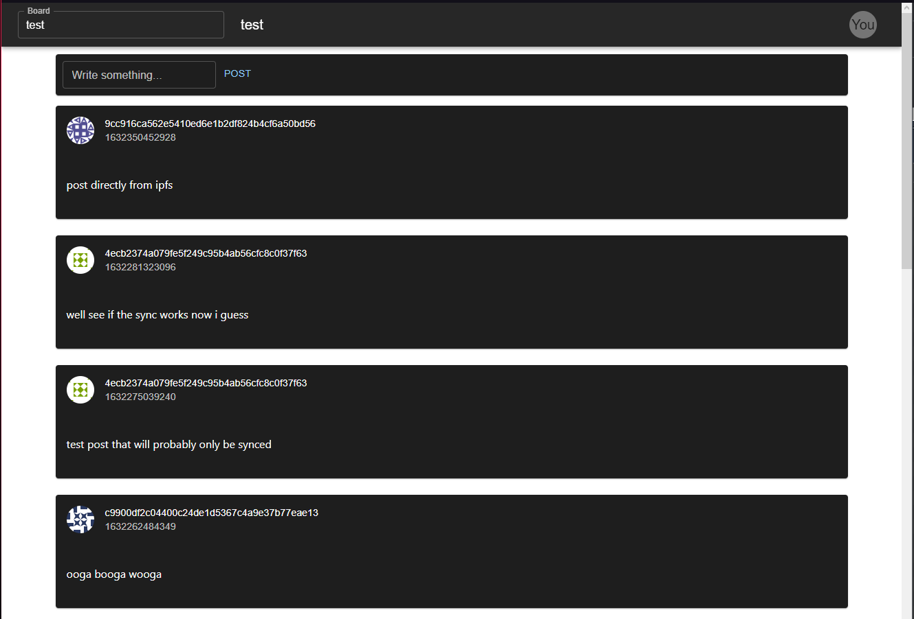

# IPSM - Inter-Planetary Social Media

IPSM is a decentralized social media network built on top of IPFS.

All you need to join is a local IPFS node with api running on localhost port 5001.
After that all you need to do is visit here: https://k51qzi5uqu5dj00g8grr9pby14wibhuhkgxo7gdb5ebnlem2eaeob3809qni8p.ipns.dewb.link

*This is an IPFS url that you can open in your browser, but it requires IPFS to be installed on your machine to get access to the IPFS API.
[How to install IPFS](https://docs.ipfs.io)*

## Alpha notice
This project is still very young and in the alpha stages.
Expect changes in the framework as well as protocol.

## Developer quickstart
This can be found [here](./docs/Getting_started.md)

## Common issues

If you get any errors concerning CORS have a look at [this](https://stackoverflow.com/questions/42708251/how-to-do-cross-origin-requests-on-ipfs), should have everything to get you sorted.
